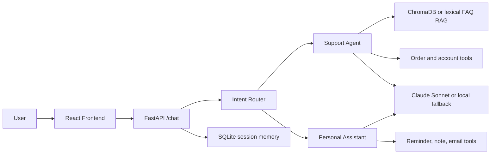

# AstraDesk AI: Dual-Mode AI Chatbot

A production-readable full-stack AI chatbot with two modes:

- Customer Support Agent: intent routing, FAQ RAG, order/account mock tools, conservative confidence handling.
- Personal AI Assistant: mock function calling for reminders, notes, and email drafts with session memory.

The backend is FastAPI + SQLAlchemy + SQLite/PostgreSQL-ready + ChromaDB-ready + Anthropic Claude-ready. The frontend is React + Vite + Tailwind + Framer Motion + Zustand + TanStack Query + Recharts.

## Architecture



## Project Structure

```text
backend/app/main.py
backend/app/routers/chat.py
backend/app/agents/
backend/app/services/
backend/app/database/
backend/app/tools/
backend/app/prompts/
backend/app/data/
frontend/src/pages/
frontend/src/components/
frontend/src/store/
frontend/src/lib/
```

## Environment Variables

Copy the example file:

```bash
cd backend
cp .env.example .env
```

Important values:

```text
ANTHROPIC_API_KEY=
ANTHROPIC_MODEL=claude-3-5-sonnet-20241022
DATABASE_URL=sqlite+aiosqlite:///./chatbot.db
CHROMA_PATH=./chroma
CORS_ORIGINS=["http://localhost:5173"]
```

If `ANTHROPIC_API_KEY` is empty, the backend still runs with deterministic local fallback responses. If ChromaDB is unavailable, FAQ retrieval falls back to lexical scoring.

## Run Backend

```bash
cd backend
python -m venv .venv
.venv\Scripts\activate
pip install -r requirements.txt
uvicorn app.main:app --reload
```

Open API docs at `http://localhost:8000/docs`.

## Build Vector Database

FAQ ingestion runs at startup. You can also run:

```bash
cd backend
python scripts/ingest_faq.py
```

## Run Frontend

```bash
cd frontend
npm install
npm run dev
```

Open `http://localhost:5173`.

## Docker

```bash
cp backend/.env.example backend/.env
docker compose up --build
```

Frontend: `http://localhost:5173`
Backend: `http://localhost:8000`

## API

### POST `/chat`

```json
{
  "session_id": "abc123",
  "message": "Where is my order ORD-1001?",
  "requested_mode": "support",
  "stream": false
}
```

Response:

```json
{
  "session_id": "abc123",
  "mode": "support",
  "response": "...",
  "confidence": 0.94,
  "sources": ["01-shipping.md"],
  "tool_calls": []
}
```

Set `"stream": true` for Server-Sent Events with `meta`, `token`, and `done` events.

### Other endpoints

- `GET /health`
- `POST /reset-session`
- `POST /ingest`

## Testing

```bash
cd backend
pytest
python scripts/sample_conversations.py
```

Import `backend/postman_collection.json` into Postman for manual API checks.

## Sample Conversations

Support:

```text
User: Where is my order ORD-1001?
Assistant: Support mode selected, retrieves FAQ context, looks up the mock order, and answers with confidence and sources.
```

Assistant:

```text
User: Remind me tomorrow at 9 AM to call John.
Assistant: Done. I used set reminder and saved the result to this session's short-term memory.
```

## JWT-Ready Auth Structure

The API is organized around routers, dependency injection, and SQLAlchemy models so an auth router can be added cleanly. A production auth layer would add user tables, password hashing, OAuth/JWT issuance, and per-user session scoping.

## Future Improvements

- Add real document upload indexing from the Knowledge Base page.
- Add authenticated multi-user workspaces.
- Add PostgreSQL migrations with Alembic.
- Add production-grade observability with OpenTelemetry.
- Replace mock assistant tools with calendar, notes, and email integrations.
- Add evaluation suites for support answer groundedness.
